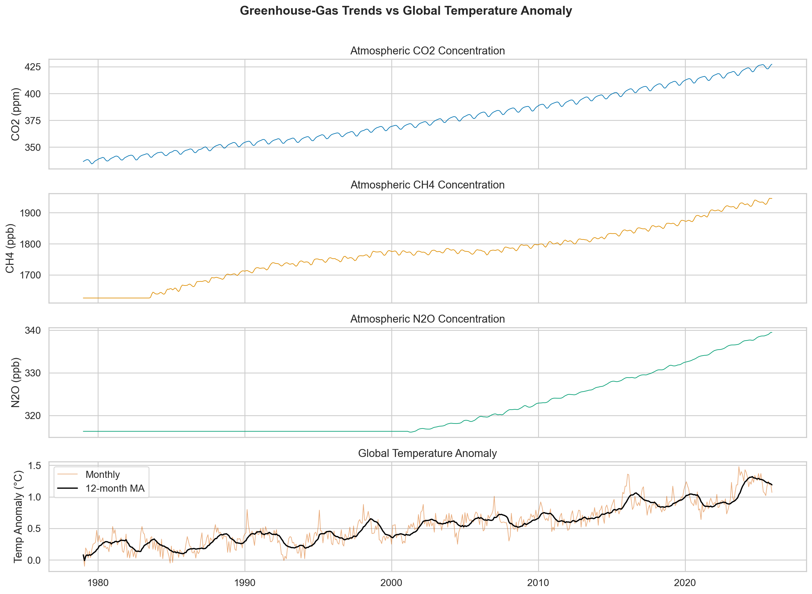
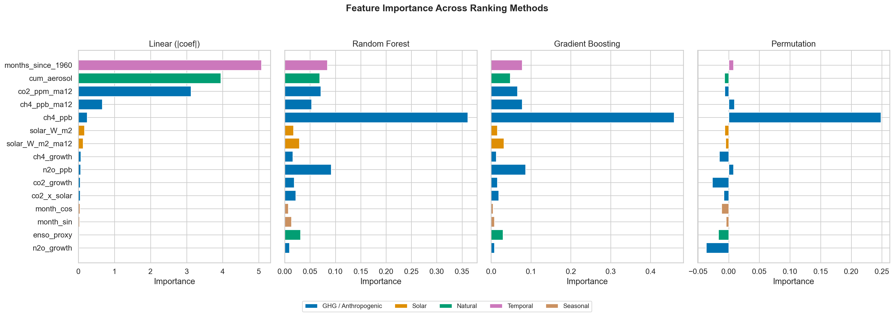
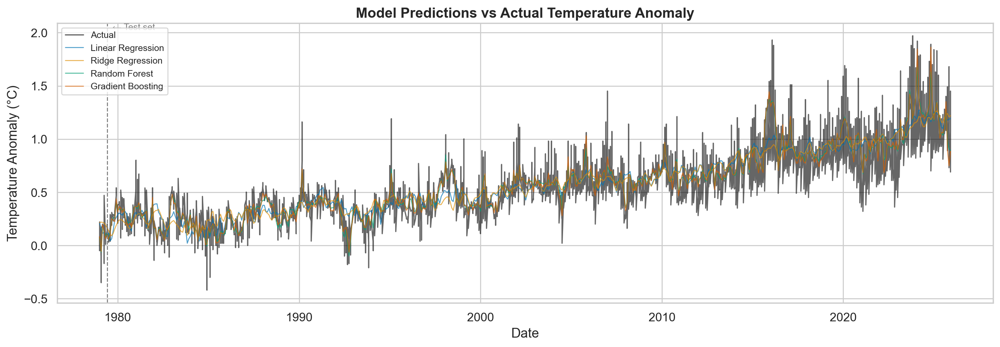

# Methodology

This document outlines the pipeline and shows the main result figures produced by the project.

## Pipeline overview

1. **Data collection** (`src/data_collection.py`) — Fetches monthly data from NOAA GML (CO₂, CH₄, N₂O), NASA GISS (temperature anomaly for Global, NH, SH), an NCEI-consistent solar series, and OWID (emissions). Merges on year/month and writes `data/raw/raw_merged.csv` (≥1000 rows).
2. **Pipeline** (`src/pipeline.py`) — Loads raw data, adds volcanic/aerosol proxies, builds features (growth rates, 12‑month moving averages, etc.), fits linear, ridge, random forest, and gradient boosting models, and exports feature matrix, importance table, and predictions to `data/processed/`.
3. **Visualization** (`src/visualize.py`) — Reads the processed CSVs and generates the figures below, saved in `results/`.

---

## Result figures

### 1. Greenhouse gases and temperature anomaly

**Figure 1.** Time series of atmospheric CO₂ (ppm), CH₄ (ppb), and N₂O (ppb) with global temperature anomaly (°C). Temperature is shown as monthly values and as a 12‑month moving average. Used to compare long‑term GHG trends with warming.

---

### 2. Feature importance by method

**Figure 2.** Feature importance from four methods: standardized absolute linear coefficients, random forest impurity, gradient boosting impurity, and permutation importance. Bars are grouped by factor type (GHG, solar, natural, temporal, seasonal). Supports comparison of which drivers matter for temperature in each model.

---

### 3. Top three features vs temperature

**Figure 3.** Scatter plots of the three highest-ranked features (by permutation importance) against temperature anomaly, with linear fit and Pearson *r*. Shows strength and sign of the relationship for the main drivers.

---

### 4. Model predictions vs actual temperature

**Figure 4.** Actual global temperature anomaly (black) and predictions from the four fitted models over time. The vertical dashed line marks the start of the test set (70/30 split). Used to compare model fit and generalization.

---

To regenerate the figures, run `python -m src.visualize` from the project root (after running the pipeline).
