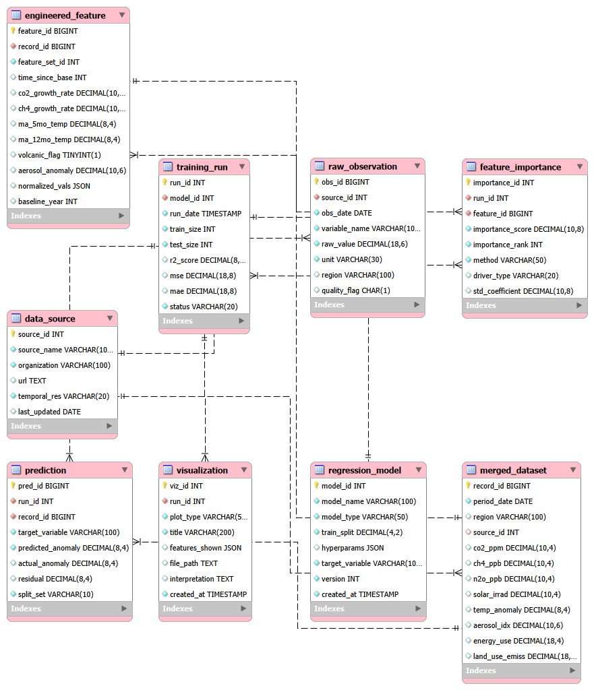

# Climate Change Root Cause Analysis
Identifying Root Causes of Global Temperature Change Using Multi-Source Data Integration and Regression Feature Ranking

## Project Overview
This project builds a comprehensive regression-based analytical pipeline to identify the most influential drivers ("root causes") of global temperature change. It integrates data from multiple scientific sources and uses a feature ranking approach to identify the most important sources, trains multiple regression models, and uses feature importance ranking to determine which environmental fators contribution most to temperature variation.

## Data Sources
1. **NOAA Global Monitoring Laboratory (GML)** - Global temperature data from 1880 to 2019.
    - CO₂, CH₄, N₂O atmospheric concentrations
    - Source: https://gml.noaa.gov/ccgg/trends/
2. **NASA GISS Surface Temperature Analysis (GISTEMP)** - Global temperature data from 1880 to 2019.
    - Global surface temperature anomaly from 1951 to 2014.
    - Source: https://data.giss.nasa.gov/gistemp/
3. **Our World in Data (OWID)** - Global population data from 1950 to 2019.
    - Source: https://ourworldindata.org/co2-emissions

## Project Structure

## Methodology

